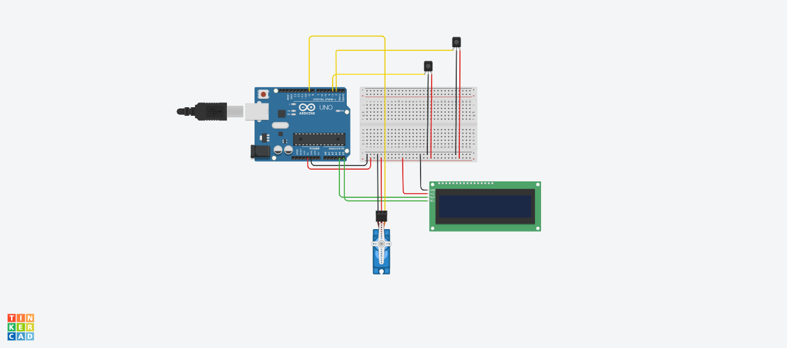

# 🚗 Smart Parking System using Arduino

This project is a **Smart Parking System** that automates vehicle entry and exit using **IR Sensors, a Servo Motor, and an LCD Display**. The system keeps track of available parking slots and automatically controls the gate.

---

## 📌 Features
✅ **Automatic Gate Control** – Opens and closes using a **Servo Motor**  
✅ **Vehicle Detection** – Uses **IR Sensors** for entry and exit tracking  
✅ **LCD Display (I2C)** – Shows real-time parking slot availability  
✅ **Over-Parking Prevention** – Displays **"Parking Full"** when no slots are available  
✅ **User-Friendly & Efficient** – Ideal for smart city solutions  

---

## 🛠️ Components Used
| Component              | Quantity |
|------------------------|----------|
| Arduino Uno           | 1        |
| IR Sensors (Entry & Exit) | 2      |
| SG90 Servo Motor      | 1        |
| 16x2 LCD Display (I2C) | 1      |
| Breadboard            | 1        |
| Jumper Wires          | As needed |

---

## 🔌 Circuit Connections
| Component | Arduino Pin |
|-----------|------------|
| **Entry IR Sensor** | D2 |
| **Exit IR Sensor** | D3 |
| **Servo Motor** | D9 |
| **LCD SDA** | A4 |
| **LCD SCL** | A5 |
| **Power & Ground** | 5V & GND |

---

## 📜 Working Principle
1. **System Initialization**: LCD, sensors, and servo motor are set up.
2. **Vehicle Entry Detection**:
   - When the **entry IR sensor** detects a vehicle, the servo motor **opens the gate**.
   - The system **updates available slots** and **closes the gate** after 2 seconds.
3. **Vehicle Exit Detection**:
   - When the **exit IR sensor** detects a vehicle leaving, the available slots are **incremented**.
4. **Parking Full Check**:
   - If no slots are available, the LCD displays **"Parking Full"**.
5. **Real-Time Display**:
   - The LCD continuously updates the available slot count.

---

## 🚀 Getting Started
### 🏗️ Setup Instructions
1. **Assemble the Circuit** as per the diagram.
2. **Connect Arduino to PC** via USB.
3. **Upload the Code** to the Arduino Uno using the **Arduino IDE**.
4. **Power up the system** and observe the LCD and servo motor operation.
5. **Test Entry & Exit** by placing an object in front of the IR sensors.

---

## 📷 Circuit Diagram

## 📦 Required Libraries
Ensure you have these libraries installed in the **Arduino IDE**:
- **Wire.h** – I2C communication for LCD
- **LiquidCrystal_I2C.h** – 16x2 LCD Display
- **Servo.h** – Servo Motor control

To install, go to **Arduino IDE → Sketch → Include Library → Manage Libraries**, then search and install them.

---

## 🔥 Future Improvements
🚀 Add an **RFID system** for authorized parking  
📡 Integrate **WiFi (ESP8266)** for online monitoring  
🎯 Use **Ultrasonic Sensors** for more precise detection  
🔋 Optimize **Power Consumption** for efficiency  

---

## 💡 Troubleshooting
### ❌ LCD Not Displaying Anything?
- Check the **I2C connections (SDA → A4, SCL → A5)**.
- Ensure the **correct I2C address** in the code.

### ❌ Servo Motor Not Moving?
- Verify if the **pin (D9) is correctly connected**.
- Ensure **power supply (5V)** is stable.

### ❌ IR Sensors Not Detecting?
- Try adjusting the **sensor distance**.
- Check **wiring and 5V power supply**.

---

## 🏆 Acknowledgments
Special thanks to **Tinkercad** for simulation and **Arduino Community** for support.

---

